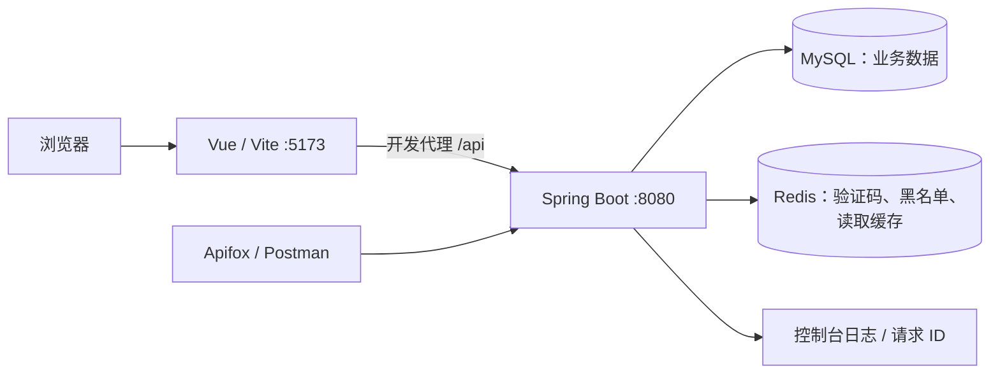

# 校园二手交易平台

面向校园闲置交易的学习项目：邮箱验证码注册、JWT 登录与退出、分类与商品、收藏、订单状态机、管理员后台，以及 Redis 分类/热门缓存。

前端使用 Vue 3、TypeScript、Element Plus、Pinia；后端使用 Spring Boot 4.1.0、Spring Security、MyBatis-Plus、MySQL、Redis 和 Flyway。付款为模拟操作，不接入支付机构。当前验证码仅写入本地 Redis，**未发送真实邮件**。

## 架构与目录



| 目录 | 内容 |
| --- | --- |
| `campus-trade-server/` | Java 后端，根包 `com.campus.trade.campustradeserver` |
| `campus-trade-web/` | Vue 前端及 Node 版本声明 |
| `docs/api/` | API 与错误码文档 |
| `docs/postman/` | 可导入 Postman/Apifox 的请求集合 |
| `docs/学习清单/` | 学习路线、阶段交接和验收记录 |

## 环境要求

| 工具 | 要求/用途 |
| --- | --- |
| JDK | 源码编译目标 Java 17；使用支持 Java 17 的 JDK，不能使用 Java 8。确认 IDEA Project SDK 与 Maven JDK 一致 |
| Maven | Wrapper 固定 3.9.16；首次使用需要下载 Maven 与依赖 |
| Node.js | **20.19.5**，以 `campus-trade-web/.nvmrc` 为准 |
| npm | 随所选 Node 提供，使用 package-lock.json 安装依赖 |
| MySQL | 建议 8.x，需先创建数据库，业务表由 Flyway 创建 |
| Redis | 本地默认 localhost:6379、DB 0；项目未固定服务端版本，阶段 7 验收使用 8.10.0 |
| Apifox / Postman | 手动接口验收；浏览器用于页面验收 |
| Python 3、redis-cli | 可选，用于本地验证码取码；剪贴板示例另需 macOS pbcopy |

## 首次准备数据库

在 MySQL 管理客户端，以具备创建库权限的账号执行：

```sql
CREATE DATABASE IF NOT EXISTS campus_trade
  CHARACTER SET utf8mb4 COLLATE utf8mb4_unicode_ci;
```

准备一个能访问该库的本地数据库账号。应用启动会执行建表迁移，因此开发账号需要相应建表与读写权限。不要把真实密码写入共享文档。

迁移位于 `campus-trade-server/src/main/resources/db/migration/`：V1 用户、V2 分类、V3 商品、V4 初始分类、V5 收藏、V6 订单。Flyway 首次启动按版本执行，并维护 schema history；无需手动逐个执行 SQL。不要修改已经应用的迁移或对已有业务库盲目执行 clean，后续结构变化使用新迁移。

## 配置后端（选择一种方式）

### 方式 A：IDEA 本地配置

将 [application-local.example.yml](campus-trade-server/src/main/resources/application-local.example.yml) 复制为同目录 `application-local.yml`，填写本机数据库地址、账号、密码和 `app.jwt.secret`。

`application.yml` 已通过 `spring.config.import` 导入此本地文件，无需额外激活 local profile。本地文件已被 Git 忽略。Redis 默认地址和超时在 `application.yml`，需要覆盖时可在本地文件添加 `spring.data.redis` 配置。

JWT 密钥必须是 **至少 32 个随机字节的 Base64 编码**。可在本地执行 `openssl rand -base64 32` 生成并粘贴到本地配置；不要将输出放进截图、日志或共享文件。示例占位符不能用于启动。

### 方式 B：终端环境变量

在项目根目录将 [.env.example](.env.example) 复制为 `.env`，替换数据库和 JWT 占位符。其他变量按本地环境调整。

Spring Boot **不会自动读取根 `.env`**。在同一个 bash/zsh 终端中执行：

```bash
# 从项目根目录开始，仅加载你自己填写并信任的本地文件
set -a
source ./.env
set +a
cd campus-trade-server
./mvnw -Dmaven.test.skip=true spring-boot:run
```

`source` 会执行 shell 文件，所以仅用于你自己维护的配置。若从 IDEA 启动，要把同名变量填入 Run Configuration 的 Environment variables；IDEA 不会自动继承另一个终端后来加载的变量。常规环境变量会覆盖同名配置文件属性，避免两种方式同时填写互相矛盾的值。

| 变量 | 对应配置/说明 |
| --- | --- |
| SPRING_DATASOURCE_URL / USERNAME / PASSWORD | JDBC 连接配置 |
| APP_JWT_SECRET | app.jwt.secret；必须自行生成 |
| JWT_EXPIRE_SECONDS | 当前 application.yml 显式读取，默认 7200 秒 |
| SPRING_DATA_REDIS_HOST / PORT / DATABASE | 默认 localhost / 6379 / 0 |
| SPRING_DATA_REDIS_USERNAME / PASSWORD | Redis 配置了认证时才填写 |
| SPRING_DATA_REDIS_CONNECT_TIMEOUT / TIMEOUT | 默认各 1s |
| SERVER_PORT | 默认 8080；更改时同时调整前端代理目标和 API 客户端 baseUrl |

前端 API 使用同源 `/api`，开发代理在 `campus-trade-web/vite.config.ts` 指向 `http://localhost:8080`。当前没有 `VITE_API_URL` 开关，根 `.env` 也不会自动改变这个代理目标。

## 启动与确认

1. 启动 MySQL、Redis，完成上述本地配置。
2. 确认 `java -version` 与 `./mvnw -v` 使用正确 JDK。IDEA 运行 `CampusTradeServerApplication`，或在后端目录运行 `./mvnw -Dmaven.test.skip=true spring-boot:run`。
3. 确认控制台 Flyway 成功、Tomcat 在 8080 启动。匿名请求 `GET http://localhost:8080/api/categories` 应返回 HTTP 200/code=0。**`/api/health` 当前要求登录**，不能将匿名 401 当作启动失败。
4. 新终端进入前端目录，使用项目声明的 Node 版本：

```bash
cd campus-trade-web
nvm install       # 首次没有该版本时执行，读取 .nvmrc
nvm use
node --version   # 应为 v20.19.5
npm ci
npm run dev
```

不使用 nvm 时，使用自己的版本管理工具选择同一个版本。打开 Vite 实际输出的地址，默认 `http://localhost:5173/`；端口被占用时 Vite 可能选择其他端口。

## 本地演示账号与注册

项目**没有内置默认账号或默认密码**，迁移不会创建管理员。不要把现有开发者账号当作新环境必然存在的数据。

1. 在注册页面或 Apifox 发送验证码，按 [本地取码说明](docs/logging.md) 从 Redis 复制到剪贴板，完成注册。验证码 5 分钟有效，发送间隔 60 秒。
2. 创建两个普通测试用户，分别作为卖家和买家；再创建一个专用账号用于管理员演示。
3. 仅在你自己的本地开发数据库中，由数据库管理员将已注册的专用账号提升为管理员。例如把下面示例用户名替换成你刚创建的账号，确认只影响一行：

```sql
UPDATE sys_user SET role = 'ADMIN'
WHERE username = 'local_demo_admin' AND role = 'USER';
```

随后重新登录该账号。不要手工写入明文密码；注册流程已保存 BCrypt 哈希。公开注册固定创建 USER，前端菜单不能替代后端权限检查。

## 接口与主流程验收

从 [Postman 集合及使用说明](docs/postman/README.md) 下载集合，在 Postman Import 中导入，或在 Apifox 导入数据中选择 Postman 格式。配置本地环境变量后逐条发送；集合含 69 条请求、覆盖 34 个接口，但不能按全文件顺序一次执行全部写操作。

推荐流程：

1. 管理员创建专用测试分类；卖家发布商品。
2. 买家收藏、取消收藏，再下单；订单 PENDING_PAYMENT，商品 LOCKED。
3. 买家模拟付款；订单 PAID，商品 SOLD。确认完成后订单 COMPLETED，商品仍 SOLD。
4. 用另一件商品测试下单并取消；订单 CANCELLED，商品恢复 ON_SALE。
5. 分别验收越权、非法参数、重复操作、管理员禁用/恢复、退出后旧 Token 失效。

逐项记录 HTTP/code 和两表前后状态，详见 [手动验收对照表](docs/manual-acceptance.md)。真实密码、验证码、Token、完整图片不保存到集合、日志或截图。集合文件已完成静态检查，实际导入过程仍需在使用者的工具中确认。

## 日志、缓存与故障排查

- 日志默认输出到 IDEA Run/Debug 控制台或启动终端，**没有默认日志文件**。从响应头 X-Request-ID 检索同一请求日志，详见 [日志说明](docs/logging.md)。如需本地文件，可自行设置 Spring Boot 的 `logging.file.name`，并安排文件清理。
- 类别与热门缓存的键、TTL、失效时机见 [缓存约定](docs/cache.md)。匿名缓存查询 Redis 失败时可降级 MySQL；认证 Redis 失败返回 503，不能跳过黑名单校验。
- 401 表示未认证，403 表示权限不足，503 表示依赖暂不可用；业务错误多数为 HTTP 400，具体区分见 [错误码表](docs/api/error-codes.md)。
- 数据库连接失败：核对库是否存在、账号权限和 JDBC 配置。JWT 启动失败：检查 Base64 与解码后长度。前端 `/api` 失败：核对后端端口、Vite 代理及实际服务是否已重启。

## 构建与执行约定

前端构建命令（在已选 Node 20.19.5 的前端目录）：

```bash
npm run build
```

该脚本先做 TypeScript 类型检查，再输出 `dist/`。后端打包可在后端目录执行 `./mvnw -Dmaven.test.skip=true package`，产物位于 `target/`。本文提供命令，不代表本轮已执行；当前会话约定不主动运行前端构建、格式化或自动测试。

阶段 7/8 修改曾完成后端编译及定向真实 HTTP/浏览器验收；用户反馈部分后端用例通过，不等同全套独立复核。前端新菜单、退出失败、表单恢复等已定向检查，未穷尽所有尺寸和交互。最新范围见 [阶段 8 交接](docs/学习清单/阶段-8-今日交接记录-2026-09-08.md)、[前端检查记录](docs/学习清单/阶段-8-前端检查记录-2026-09-08.md)。本 README 的全新环境启动流程仍待从头复走。

仍需明确健康页权限、重新启用用户的旧 Token 行为等已记录差异，并补齐剩余验收。Docker、Compose、Nginx 和真实部署属于阶段 9，当前不宣称已具备一键部署。

## 提交前

本地 `.env`、`application-local.yml`、密钥、Token、数据库备份不要提交；`node_modules/`、`target/`、`dist/` 与 IDE 文件也不提交。示例配置只有占位符。暂存和提交由使用者自行检查后完成。
